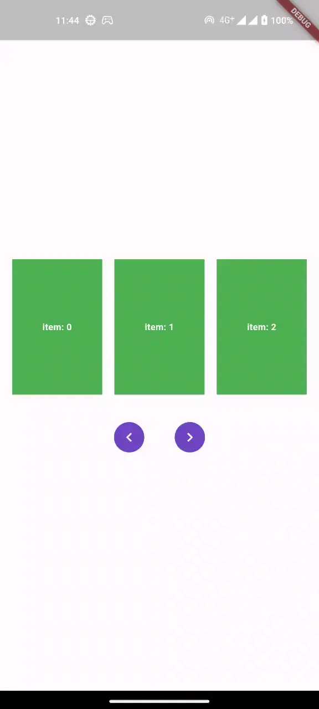

# horizontal_list_view [](https://pub.dartlang.org/packages/horizontal_list_view)

Simple and customizable horizontal list view widget for displaying a list of items in a horizontal layout. This package is designed to simplify the creation of horizontal lists with a specified crossAxisCount without the need to provide a fixed height for the ListView.



## Installing

Add to pubspec.yaml file

```sh
dependencies:
  horizontal_list_view: ^1.1.0
```

import

```sh
import 'package:horizontal_list_view/horizontal_list_view.dart';
```

## Usage

Using `HorizontalListView`

```dart
 HorizontalListView(
   crossAxisCount: 2, // Number of items displayed per row.
   crossAxisSpacing: 8.0, // Spacing between items in the same row.
   alignment: CrossAxisAlignment.center, // Alignment of items within the row (default is center)
   controller: HorizontalListViewController(), //Optional scroll controller.
   children: [
     // List of child widgets
     // ...
   ],
)
```

Using `HorizontalListView.builder`

If you want to create a horizontal list view with dynamic content, you can use `HorizontalListView.builder`. Here`s an example:

```dart
import 'package:horizontal_list_view/horizontal_list_view.dart';

HorizontalListView.builder(
    crossAxisCount: 3, // Number of items displayed per row.
    crossAxisSpacing: 16, // Spacing between items in the same row.
    alignment: CrossAxisAlignment.center, // Alignment of items within the row (default is center)
    controller: HorizontalListViewController(), // Optional scroll controller.
    itemCount: 12, // Total number of items in the list.
    itemBuilder: (BuildContext context, int index) {
        // Create and return the widgets for each item.
        return AspectRatio(
            aspectRatio: 16 / 9,
            child: Container(
                color: Colors.red,
                child: Center(
                    child: Text('item: $index'),
                ),
            ),
        );
    },
)
```

In this example, you spacify the number of items per row (`crossAxisCount`), spacing between items (`crossAxisSpacing`), and provide an `itemBuilder` function to create the individual items based on the index.

